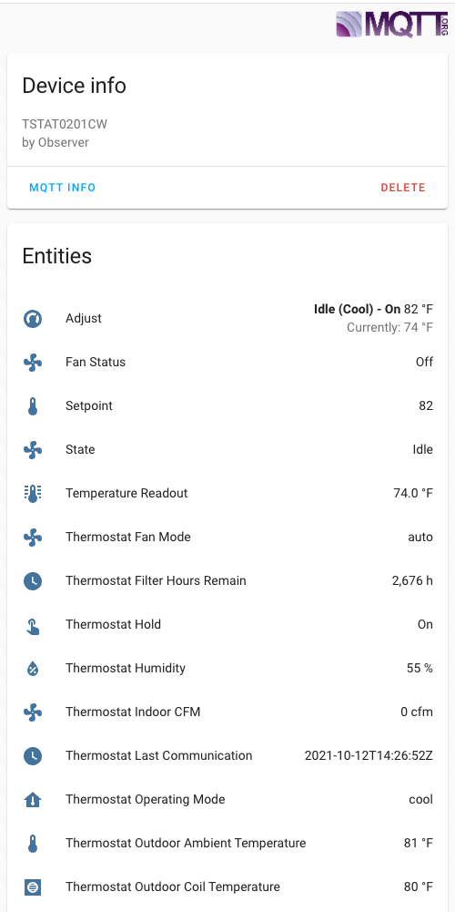

# Thermostat MQTT container
<a href="https://www.buymeacoffee.com/aneisch" target="_blank"></a><br>

Acts as API server for Observer Communicating HVAC controller (TSTAT0201CW). Bridges MQTT and thermostat for control through applications such as Home Assistant. You'll need to point your thermostat at this application by modifying the observer server address on the thermostat.

## Usage


### Example docker-compose

```yaml
version: '3.2'
services:
    thermostat_api_server:
        container_name: thermostat_api_server
        image: ghcr.io/aneisch/thermostat_api_server:latest # amd64, or latest-arm64 for ARM devices
        ports:
            - '8080:8080'
        environment:
            # Name for Device in HA
            - THERMOSTAT_NAME=Upstairs
            - THERMOSTAT_SERIAL=5687J272316
            - MQTT_SERVER=10.0.1.22 # This can be an internal docker IP or an IP on your "real" network that exposes the MQTT service
            # Optional MQTT_PORT - defaults to 1883
            #- MQTT_PORT=1883
            # Optional username/password
            #- MQTT_USERNAME=username
            #- MQTT_PASSWORD=password
            # Used in reply to thermostat
            - API_SERVER_ADDRESS=10.0.1.22 # This should be the IP where a wifi client can access this container port 8080, NOT an internal docker IP
        restart: always
```
### Home Assistant Configuration

Uses [MQTT Discovery](https://www.home-assistant.io/docs/mqtt/discovery/) to add climate device and associated sensors. If MQTT discovery is enabled, no configuration should be necessary aside from setting container environment variables.  


